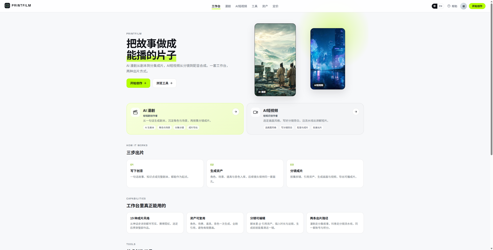
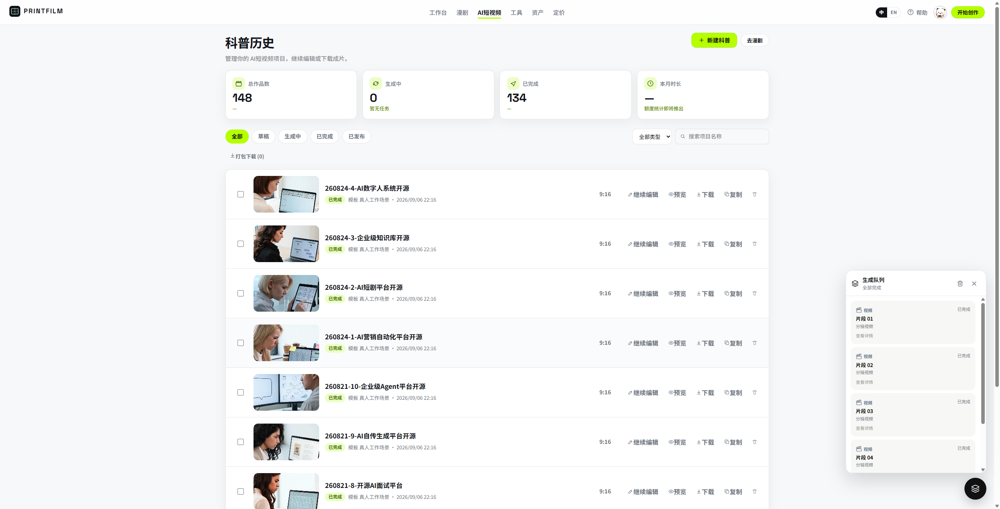
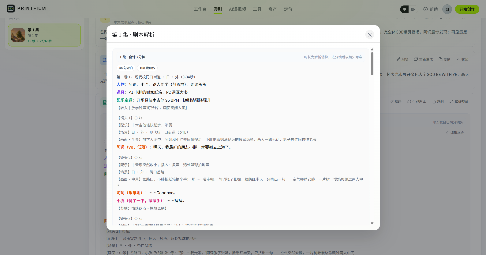
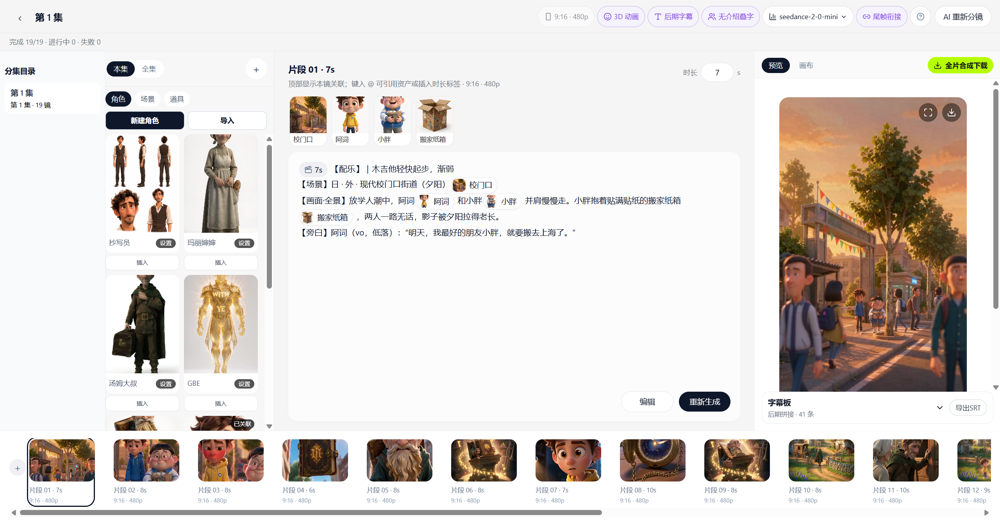
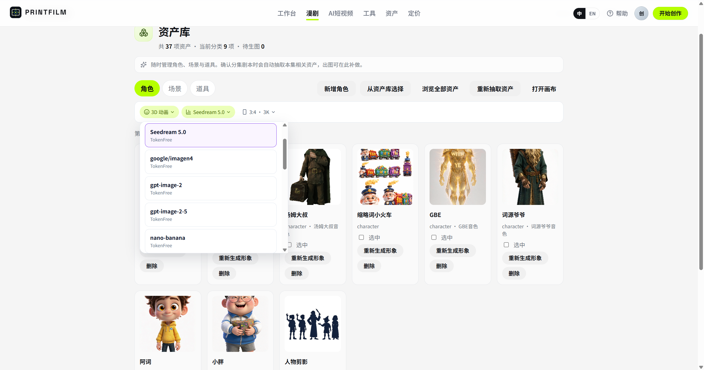

# PRINTFILM

[](https://github.com/yi1108/printfilm)
[](LICENSE)

> **把故事做成能播的片子** — AI 漫剧与 AI 短视频，从文案到成片。

模板驱动的创作平台：主题 / 剧本 → 分镜 → 生图 → 生视频 → 成片。口播由 Seedance 出片时生成，无需单独配音。

**源码**：[github.com/yi1108/printfilm](https://github.com/yi1108/printfilm) · **版本** 0.2.0

## 界面预览

**工作台**



**AI 短视频** — 历史、分镜、成片

| 项目历史 | 分镜工作台 | 成片预览 |
|:---:|:---:|:---:|
|  |  |  |

**AI 漫剧** — 项目、分集、剧本、分镜、资产

| 项目列表 | 分集工作台 | 剧本解析 |
|:---:|:---:|:---:|
|  |  |  |

| 分镜编辑 | 资产库 | 管理后台 |
|:---:|:---:|:---:|
|  |  |  |

## 核心功能

### 1. AI 漫剧

从一句话到分集成片，角色与场景可复用。

- 大纲 / 剧情摘要 / 剧本内容
- 资产库：角色、场景、道具
- 解析成镜后进入分镜编辑与画布
- 细则见 [docs/EPISODE_RULES.md](docs/EPISODE_RULES.md)

### 2. AI 短视频

选模板后沿分镜流水线出片，适合获客与科普。

- 20+ 内置风格模板
- `full`（图 + 视频 + 合成）或 `image_text`（静图，更快更省）
- 单镜重绘、重生视频；任务离开页面也会继续跑
- 成片由 FFmpeg 合成

### 3. 工具中心

不走完整流水线的单点能力：文生图、图生图、图生产品、文生视频、视频生视频、电商拼图。

### 4. 管理后台与开放 API

用户、订单、模板、任务中心、模型路由。开放接口 `/api/v1` 生图 / 生视频（Bearer 或 `X-Api-Key`）。

## 工作流程

```
输入主题或剧本
    → 分镜
    → 生图
    → 生视频（Seedance 自带口播）
    → FFmpeg 合成成片
```

每个阶段都可以回头重做单镜；进度在历史页查看。

## 技术特点

- **两条产品线共用一套生成能力** — 漫剧与短视频走同一上游
- **进程内任务平台** — scheduler / executor / poller，无需单独 Celery Worker
- **模型可换** — 管理后台配置 TokenFree Key 与模型，不必改代码
- **Docker 一键启动** — 公开镜像，拉取无需登录
- **可选计费** — 默认关闭；开启后按用量结算，见 [docs/BILLING.md](docs/BILLING.md)

## 技术栈

| 层 | 选型 |
|----|------|
| 后端 | Python 3.12 · FastAPI · SQLAlchemy · PostgreSQL · Redis |
| 前端 | React 19 · TypeScript · Vite 8（管理端 Tailwind + shadcn） |
| AI | TokenFree New API（文字 / 图 / 视频） |
| 部署 | Docker 全栈镜像，或本机三进程 + 中间件容器 |

## 快速开始（Docker 一键启动）

本机只需安装 [Docker Desktop](https://www.docker.com/products/docker-desktop/)（或 Docker Engine + Compose）。镜像在阿里云 ACR `gcc` 公开命名空间，**拉取无需登录**。

### 1. 克隆并准备环境变量

```bash
git clone https://github.com/yi1108/printfilm.git
cd printfilm

cp deploy/.env.docker.example deploy/.env.docker
```

编辑 `deploy/.env.docker`，至少改这三项：

| 变量 | 说明 |
|------|------|
| `POSTGRES_PASSWORD` | 数据库密码（勿用示例默认值） |
| `SECRET_KEY` | 任意长随机串（会话 / 密钥加密） |
| `OPENAI_API_KEY` / `ARK_API_KEY` | TokenFree API Key（同一把填两处即可） |

无 Key 想先看界面：把 `ARK_MOCK=true`。

### 2. 一键启动

```bash
docker compose --env-file deploy/.env.docker up -d
```

等约半分钟（API 健康检查通过后，web / admin 才会起来）。

| 服务 | 地址 |
|------|------|
| 用户端 | http://localhost:8080 |
| 管理后台 | http://localhost:8081 |
| API / 文档 | http://localhost:8000 · `/docs` |
| 健康检查 | http://localhost:8000/api/health |

常用：

```bash
docker compose --env-file deploy/.env.docker ps          # 状态
docker compose --env-file deploy/.env.docker logs -f api # 看日志
docker compose --env-file deploy/.env.docker down        # 停止（保留数据卷）
```

### 3. 注册与管理员

| 角色 | 怎么拿 |
|------|--------|
| 普通用户 | 打开用户端 → `/auth` 邮箱注册 |
| 管理员 | 先用该邮箱注册 → 在 `.env.docker` 设 `ADMIN_BOOTSTRAP_EMAILS=你的邮箱` → `docker compose --env-file deploy/.env.docker up -d --force-recreate api`（**只提权，不造号**） |

仓库无内置演示账号；生产请立刻改掉密钥。

### 4. 更新到最新镜像

```bash
docker compose --env-file deploy/.env.docker pull
docker compose --env-file deploy/.env.docker up -d
```

### 5. 从源码构建（可选）

改过前后端代码，或拉不到 ACR 时：

```bash
docker compose --env-file deploy/.env.docker -f docker-compose.full.yml up -d --build
```

## 配置 TokenFree API Key

开源版文字 / 图 / 视频统一走 **TokenFree New API**（OpenAI 兼容：`https://www.tokenfree.com/v1`）。没有 Key 时只能 `ARK_MOCK=true` 看界面，不能真实生图 / 生视频。

### A. 在 TokenFree 拿到 Key

1. 打开 [https://www.tokenfree.com](https://www.tokenfree.com) 注册并登录。
2. 进入控制台的 **API 密钥 / Tokens**（部分部署路径为 `/token` 或 `/keys`）。
3. 点击 **创建**，填名称（如 `printfilm`），按需设额度 / 过期时间。
4. **立刻复制完整 Key**（形如 `sk-…`，只显示一次）。
5. 确认账户有余额或可用额度；模型列表里能看到你要用的对话 / 生图 / 视频模型。

> Key 等同密码，不要提交到 Git、不要发到群聊。泄露后在 TokenFree 控制台作废并重建。

### B. 写入 Docker 环境（推荐自托管首次启动）

编辑 `deploy/.env.docker`：

```env
OPENAI_API_KEY=sk-你的密钥
OPENAI_BASE_URL=https://www.tokenfree.com/v1
ARK_API_KEY=sk-你的密钥
ARK_MOCK=false
MODEL_LLM=kimi-k2.6
MODEL_IMAGE=seedream-5-0-pro
MODEL_VIDEO=seedance-2-5
```

`OPENAI_API_KEY` 与 `ARK_API_KEY` 填**同一把**即可。然后重建 API 容器使环境生效：

```bash
docker compose --env-file deploy/.env.docker up -d --force-recreate api
```

打开 http://localhost:8000/api/health ，`ark_mock` 应为 `false`。

### C. 在管理后台填写（推荐日常改 Key）

1. 用管理员登录 http://localhost:8081 。
2. 打开 **系统设置 → 模型**（路由 / TokenFree 渠道）。
3. 在 TokenFree 渠道填入 API Key 并保存。
4. 按需调整默认文字 / 图 / 视频模型；保存后即时生效，一般不必改 `.env`。

后台保存的 Key 会加密进数据库；换机器迁移时记得一并备份库，或重新在后台填写。

### D. 联调排查

| 现象 | 处理 |
|------|------|
| 生图 / 生视频报未配置 Key | 检查 `.env.docker` 是否仍为 `replace-me`，或后台渠道是否已填 Key |
| `ark_mock: true` | 关掉 `ARK_MOCK`，并确认 Key 非空后 `--force-recreate api` |
| 401 / 额度不足 | 到 TokenFree 控制台看 Key 是否启用、余额是否够 |
| 模型名 404 | 在后台模型列表里选 TokenFree 实际提供的模型 id |
## 适用场景

- 短视频 / 获客片：把卖点做成可投放的短片
- 漫剧 / 短剧：从大纲到分集，角色场景保持一致
- 单点出图出片：工具中心直接生成
- 自托管：Docker 拉镜像即可在自己的机器上跑

## 目录结构

```
backend/                  FastAPI、流水线、计费、任务运行时
frontend/                 用户端
admin/                    运营后台
deploy/                   环境变量示例、中间件 compose
docs/                     规范与专题文档
docker-compose.yml        拉公开镜像一键启动
docker-compose.full.yml   从源码构建
```

## 社区

- GitHub：https://github.com/yi1108/printfilm
- 微信加 **`gitpp88`**（备注「入群」）：部署答疑 / 短剧交流 / 模板分享

## Star History

[](https://www.star-history.com/#yi1108/printfilm&Date)

## 更多文档

| 文档 | 内容 |
|------|------|
| [docs/STANDARDS.md](docs/STANDARDS.md) | 工程规范 |
| [docs/BILLING.md](docs/BILLING.md) | 计费与易支付 |
| [docs/EPISODE_RULES.md](docs/EPISODE_RULES.md) | 漫剧分集 |
| [docs/SEEDANCE_2_5.md](docs/SEEDANCE_2_5.md) | Seedance 参数 |
| [deploy/README.md](deploy/README.md) | 本机中间件与运维 |

## 贡献

欢迎 Issue / PR。提交前对照 [docs/STANDARDS.md](docs/STANDARDS.md)：简体中文文案、函数注释、服务端分页；勿提交 `.env`、密钥与生成媒体。

```bash
cd frontend && npm run lint
cd ../admin && npm run lint
cd ../backend && pytest
```

## 开源许可

本项目采用 [MIT License](LICENSE)。
